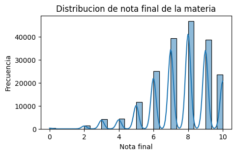

# 
*Informe y resultados arrojados*

El dataset proporcionado contenía datos del año 2022 agrupados por semestre y compuesto por **196,124 filas** y **24 columnas**. De estas columnas, las siguientes presentaban aproximadamente un **87.65% de datos nulos**:
- `fecha_mesa_epoch`
- `nombre_examen`
- `nota_parcial`
- `id_tarea`
- `nombre_de_la_tarea`
- `fecha_creacion_tarea`
- `vencimiento_tarea`
- `apertura_tarea`
- `cierre_tarea`
- `puntos_posibles`
- `nombre_entrega`
- `id_entrega_tarea`
- `puntaje`
- `formato_entrega`
- `fecha_entrega`
- `fecha_correccion`
- `fecha_creacion_tarea`

Debido a este alto porcentaje de datos nulos, se decidió eliminar estas columnas. Con el dataset resultante, se analizó la presencia de posibles duplicados. Los resultados indicaron que no eran duplicados sino que algunos estudiantes cursaron el mismo curso en el mismo semestre más de una vez, o realizaron 'actividades' en el mismo periodo de tiempo, registrándose cada día del semestre de manera consecutiva.

## Extracción de muestra

Se separó una porción del dataset original que contenía tanto filas como columnas con todos los datos completos, resultando en un archivo de **391 filas** y **23 columnas**. Este archivo se analizó para obtener una visión general de los estudiantes en un escenario ideal donde el archivo original contenga todos los datos completos. Se decidió realizar análisis estadístico y aplicar técnicas de machine learning sobre este conjunto de datos. Además, en el dashboard se utilizaron estos datos para crear un MVP (Minimum Viable Product) que mostrara resultados de rendimiento y métricas útiles para la institución que solicitó el estudio.

## Análisis Descriptivo 

### Variables Numéricas

Para las variables numéricas, se encontró una **media de 7.54** para la variable `nota_final_materia` en el total de los datos (196,124). Esto indica un promedio de calificación de 7.54 en los cursos. La desviación estándar fue de **1.7322**, lo que señala la variación de las notas finales respecto al promedio. El **25%** de los estudiantes tienen una nota final de **7 o menos**, mientras que el **70%** obtienen una nota final de **9 o menos**, siendo la máxima nota **10**. La mayoría de los estudiantes cursan alrededor de **31 días** y tienen una nota final cercana a **8**.

  

### Variables Categóricas

Para las variables categóricas, los resultados arrojados fueron inconsistentes, encontrándose varios errores en los datos. Estos son:

- **`semestre_año`**: Esta variable inicialmente denominada `periodo` arrojó 3 valores únicos cuando en realidad un año solo tiene dos semestres. Los datos encontrados fueron: `['1-2022', '01-2022', '2-2022']`. Se corrigió el valor `01-2022` por `1-2022`.

- **`id_curso`**: Esta variable, inicialmente denominada `course_uuid`, contiene 582 valores únicos aunque existen 561 nombres de cursos. Se encontró que 17 cursos contenían entre 2 y 5 ID diferentes. Se analizó el ID frecuente para cada curso y se asignó ese ID al curso correspondiente para normalizar la variable `nombre_curso` con un único ID.

- **`id_usuario`**: Esta variable, inicialmente denominada `user_uuid`, presentaba un error similar. Se encontró un `id_usuario` perteneciente a dos legajos diferentes. Se generó un nuevo ID y se asignó a uno de los dos legajos.

En resumen, existen **561 cursos**, **601 legajos**, **2 semestres**, y el curso más frecuente se denomina **'Intuitive non-volatile ability'** con un total de **11,439 registros**. Además, el estudiante con legajo **'624097JCN'** es el más frecuente entre los cursos.

Se observa que la variable `semestre_año` presenta desbalance en los datos, por lo que el promedio de notas por semestre se encuentra sesgado para el segundo semestre del año, el cual cuenta con tan solo **540 registros** mientras que el primer semestre tiene **195,584 registros**. El resultado de la nota promedio comparada entre semestres se considera sesgado.

  

## Análisis de Varianza

Se realizaron análisis de varianza para medir la relación entre las variables. Los resultados arrojados por la prueba ANOVA mostraron un **p-value de 0.0** y un **f-value grande** en ambas pruebas, lo que indica que se rechaza la hipótesis nula (H0) y se concluye que existen diferencias significativas entre las medias. Esto significa que el curso en el que un estudiante está matriculado tiene un impacto significativo en su rendimiento académico según lo medido por las notas finales.

## Análisis de la muestra extraída 

Los datos muestra extraídos del dataset original, en el que se encontraron filas y columnas completas, se analizaron para encontrar relación y significancia entre las variables que pudieran explicar la nota final. Se encontró que existen diferentes alumnos que entregaron una misma actividad, pero no se encontró la misma cantidad de ID de actividad que de alumnos que la entregaron, por lo que se considera un dato discrepante y es necesario revisarlo más a profundidad.

Realizando análisis de correlación, se demostró que existe una **relación positiva moderada** entre las notas finales de la materia y el puntaje, sugiriendo que los estudiantes con mejores notas finales también tienden a tener mejores puntajes en sus tareas. La gráfica de violínplot sugiere que el tipo de tarea influye en las notas finales de los estudiantes. Las **Actividades Prácticas Integradoras (API)** tienden a tener distribuciones de notas más concentradas y, en algunos casos, medianas más altas, lo que podría indicar que son tareas en las que los estudiantes tienden a obtener mejores resultados. En contraste, los **Trabajos Prácticos (TP)** muestran una mayor variabilidad en las notas, lo que sugiere una mayor disparidad en el rendimiento de los estudiantes en esas tareas.

Estas observaciones son consistentes con los resultados del ANOVA, que mostraron que `nombre_de_la_tarea` tiene un efecto significativo en `nota_final_materia`.

  

## Conclusiones y Recomendaciones

### Conclusiones

El análisis del dataset de cursos del año 2022 reveló varios puntos importantes:

1. **Datos Nulos y Eliminación de Columnas**: Un alto porcentaje de datos nulos en varias columnas llevó a la eliminación de estas para poder realizar un análisis más limpio y preciso.
2. **Duplicados y Repetición de Cursos**: No se encontraron duplicados exactos; en su lugar, se observó que algunos estudiantes cursaron el mismo curso más de una vez en el mismo semestre.
3. **Desbalance en los Semestres**: Existe un desbalance significativo en la cantidad de registros entre los dos semestres del año, afectando el análisis comparativo de las notas finales.
4. **Errores en Variables Categóricas**: Se detectaron y corrigieron errores en variables categóricas como `semestre_año`, `id_curso` e `id_usuario`.
5. **Impacto del Curso en el Rendimiento Académico**: Se encontró que el curso en el que un estudiante está matriculado tiene un impacto significativo en su rendimiento académico.
6. **Relación entre Notas y Tareas**: Se demostró una relación positiva moderada entre las notas finales de la materia y el puntaje en las tareas, así como un impacto significativo del tipo de tarea en las notas finales.

### Recomendaciones

Para mejorar la calidad de los estudios realizados y la medición de objetivos, es fundamental considerar las siguientes recomendaciones:

1. **Completar Datos Faltantes**: Es crucial contar con datasets completos. Se deben establecer mecanismos y procesos para garantizar la recolección y registro completos de datos desde el inicio.
2. **Normalización de Datos**: Continuar con la práctica de normalizar y limpiar los datos, asegurando que las variables categóricas no contengan errores o inconsistencias.
3. **Revisión de Procedimientos de Recolección de Datos**: Revisar y mejorar los procedimientos de recolección de datos para minimizar la cantidad de datos nulos y garantizar la integridad de los registros.
4. **Implementación de Sistemas de Validación de Datos**: Implementar sistemas automáticos de validación de datos para detectar y corregir errores en tiempo real durante la recolección de datos.

Al seguir estas recomendaciones, se podrá mejorar la calidad de los estudios realizados, facilitando una medición más precisa y efectiva de los objetivos académicos y administrativos.
